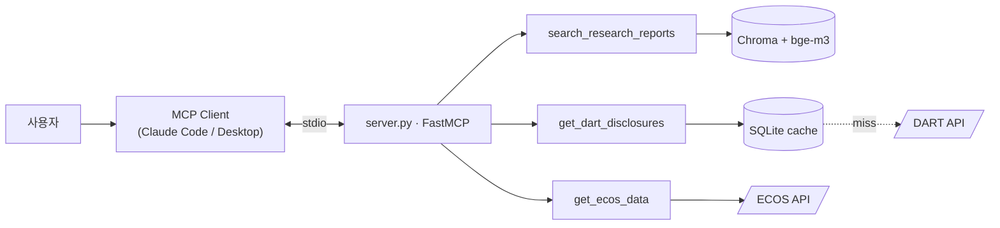

# finance-mcp-assistant

한국 금융 도메인 MCP 서버. 단일 서버에서 LLM이 다음 세 가지 데이터에 접근할 수 있게 하는 도구 3개를 노출합니다:

- **리서치 리포트 (PDF)** — 로컬 bge-m3 + Chroma 의미 검색
- **DART 공시** — 한국 상장기업 공식 공시, OPEN API에 SQLite cache-aside 적용
- **ECOS 거시 지표** — 한국은행 경제 통계, 직접 호출

stdio transport. 서버에 LLM 의존성 없음. provider 락인 없음.



전체 아키텍처 + 시퀀스 다이어그램: [architecture.md](architecture.md) · 설계 결정 근거: [Decisions.md](Decisions.md)

---

## 빠른 시작 (clone 불필요)

### 1. 무료 API 키 발급

- DART: https://opendart.fss.or.kr → 가입 → 오픈API 신청 (40자, 보통 즉시)
- ECOS: https://ecos.bok.or.kr → 회원가입 → API 인증키 신청 (20자, 즉시)

### 2. MCP 클라이언트 config에 등록

**Claude Code** (어떤 디렉토리에서든):
```bash
claude mcp add finance-mcp-assistant \
  --env DART_API_KEY=<발급받은_DART_키> \
  --env ECOS_API_KEY=<발급받은_ECOS_키> \
  -- uvx --from git+https://github.com/LChoiSH/mcp-finance-assistant.git finance-mcp-server
```

**Claude Desktop** (`~/Library/Application Support/Claude/claude_desktop_config.json`):
```json
{
  "mcpServers": {
    "finance-mcp-assistant": {
      "command": "uvx",
      "args": [
        "--from",
        "git+https://github.com/LChoiSH/mcp-finance-assistant.git",
        "finance-mcp-server"
      ],
      "env": {
        "DART_API_KEY": "<발급받은_DART_키>",
        "ECOS_API_KEY": "<발급받은_ECOS_키>"
      }
    }
  }
}
```

### 3. 클라이언트 재시작 후 자연어로 질의

첫 spawn 시 약 1~2분 (uvx가 repo clone + 휠 빌드, 이후 캐시).

```
> 삼성전자(corp_code 00126380)의 2025년 1월 공시 5건 알려줘
> 한국은행 기준금리 2024년 월별 추이 보여줘
> 삼성전자 최근 공시랑 같은 시점 기준금리 비교해줘
```

클라이언트 LLM이 각 도구의 description을 보고 자동 라우팅합니다 (각 description이 형제 도구를 cross-reference — [Decisions.md §9](Decisions.md) 참조).

---

## 제공 도구

| 도구 | 목적 | 백엔드 |
|---|---|---|
| `get_dart_disclosures` | 한국 상장기업 공시 (사업·분기보고서, 주요사항 등) | DART OPEN API + SQLite cache-aside |
| `search_research_reports` | 리서치 리포트 의미 검색 | bge-m3 (로컬) + Chroma |
| `get_ecos_data` | 한국 거시 지표 (기준금리, 환율, GDP, CPI 등) | ECOS API 직접 호출 |

각 도구의 description은 LLM에게 **언제 사용**하고 **언제 사용하지 않는지** (형제 도구로 redirect) 명시합니다. cross-reference 형식이 자동 회귀 테스트 (`tests/test_tool_macro.py::test_descriptions_cross_reference_each_other`) 로 묶여있어, 미래의 description 수정이 라우팅 정확도를 깨면 즉시 발견됩니다.

---

## 로컬 개발

```bash
git clone https://github.com/LChoiSH/mcp-finance-assistant.git
cd mcp-finance-assistant
uv sync
cp .env.example .env       # DART_API_KEY, ECOS_API_KEY 입력
uv run pytest -q           # 14 tests
```

repo에 프로젝트 레벨 `.mcp.json`이 포함돼있어, 이 디렉토리에서 Claude Code를 실행하면 자동 등록됩니다 (uvx가 아닌 로컬 소스 사용).

### MCP Inspector (디버그)

```bash
npx @modelcontextprotocol/inspector uv run finance-mcp-server
```

### RAG 파이프라인 (PDF)

`search_research_reports` 도구는 로컬 인덱스가 필요합니다. PDF를 `data/pdfs/`에 넣고 실행:

```bash
uv run python scripts/index_pdfs.py
```

첫 인덱싱 시 bge-m3 (~2.3 GB)가 `~/.cache/huggingface/`에 자동 다운로드됩니다. Apple Silicon은 MPS 자동 사용.

---

## 검증 명령

```bash
# DART 라이브 왕복
uv run pytest tests/test_dart_client.py -sv

# ECOS 라이브 왕복
uv run pytest tests/test_ecos_client.py -sv

# 캐시 miss → DART → 캐시 hit (로그로 확인)
uv run pytest tests/test_dart_repository.py::test_repo_with_live_dart -sv

# 도구 등록 + cross-reference 자동 검증
uv run pytest tests/test_tool_macro.py -v
```

각 호출 경계는 로그로 가시화됩니다 (`clients.dart`, `clients.ecos`, `storage.repository`). URL 로그의 API 키는 `***`로 마스킹 (Decisions.md §11 참조).

---

## 알려진 한계

- **`uvx --from git` 모드는 캐시 비영속** — 매 spawn마다 임시 디렉토리에서 실행되어 SQLite 캐시와 Chroma 인덱스가 세션 간 보존되지 않습니다. `search_research_reports` 또한 PDF와 인덱스가 디스크에 있어야 하므로 사실상 로컬 clone 모드가 권장됩니다. 추적: [Plan.md "알려진 한계"](Plan.md).
- **첫 검색 시 bge-m3 약 2.3GB 다운로드** 가 한 번 일어납니다.
- **PDF 표 데이터 추출 약함** (LlamaIndex 기본 로더). 프로덕션이면 표 추출 별도 파서를 결합한 하이브리드 고려.

전체 목록: [Decisions.md "안 한 것"](Decisions.md).

---

## 설계 의도 (면접용 핵심 5가지)

- **MCP 채택, 자체 REST + Function Calling 아닌 이유** — 모든 주요 LLM provider가 채택한 표준에 맞추기 위함
- **3 데이터 레이어, 3 저장 전략** — 변동성 × 접근 패턴별 차등 정책. 모든 데이터 동일 처리는 흔한 실수
- **Cache-aside는 *incremental*, 단순 hit/miss 아님** — `fetched_days` 분리 테이블로 coverage 추적, 차분만 페치
- **Tool description은 LLM 라우팅 프롬프트** — docstring 아닌 프롬프트로 취급, cross-reference 자동 회귀 검증
- **torch / bge-m3 lazy import** — stdio MCP 서버는 매 세션 fresh 프로세스, eager import는 UX 직격타

각 항목은 [Decisions.md](Decisions.md)에 *선택 / 이유 / 검토한 대안 / 한계 / 면접 답변* 5단으로 정리.

---

## 기술 스택

- Python 3.11+, [uv](https://github.com/astral-sh/uv) (환경/빌드)
- [`mcp`](https://github.com/modelcontextprotocol/python-sdk) (FastMCP, stdio)
- `httpx` (async), `pydantic` (검증)
- `llama-index` + `llama-index-vector-stores-chroma` + `llama-index-embeddings-huggingface` (`BAAI/bge-m3`)
- SQLite (stdlib `sqlite3`)
- `pytest`, `ruff`

빌드 시스템: `hatchling`. 배포: `uvx --from git+...`.
