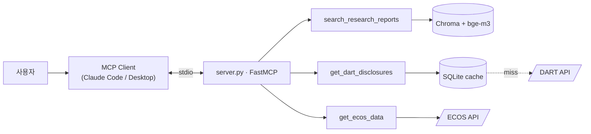

# finance-mcp-assistant

Korean finance-domain MCP server. One server exposes three tools that let an LLM reach into:

- **리서치 리포트 (PDF)** — semantic search via local bge-m3 + Chroma
- **DART 공시** — Korean corporate disclosures, cache-aside SQLite over the OPEN API
- **ECOS 거시 지표** — Bank of Korea macro indicators, direct API call

Stdio transport. No LLM dependency in the server. No provider lock-in.



Full architecture with sequence diagrams: [architecture.md](architecture.md) · Design rationale: [Decisions.md](Decisions.md)

---

## Quick start (no clone needed)

### 1. Get free API keys

- DART: https://opendart.fss.or.kr → 가입 → 오픈API 신청 (40-char key, usually instant)
- ECOS: https://ecos.bok.or.kr → 회원가입 → API 인증키 신청 (20-char key, instant)

### 2. Add to your MCP client config

**Claude Code** (any directory):
```bash
claude mcp add finance-mcp-assistant \
  --env DART_API_KEY=<your_dart_key> \
  --env ECOS_API_KEY=<your_ecos_key> \
  -- uvx --from git+https://github.com/LChoiSH/mcp-finance-assistant.git finance-mcp-server
```

**Claude Desktop** (`~/Library/Application Support/Claude/claude_desktop_config.json`):
```json
{
  "mcpServers": {
    "finance-mcp-assistant": {
      "command": "uvx",
      "args": [
        "--from",
        "git+https://github.com/LChoiSH/mcp-finance-assistant.git",
        "finance-mcp-server"
      ],
      "env": {
        "DART_API_KEY": "<your_dart_key>",
        "ECOS_API_KEY": "<your_ecos_key>"
      }
    }
  }
}
```

### 3. Restart the client and ask

First spawn: ~1–2 minutes (uvx clones the repo and builds the wheel; subsequent runs cached).

```
> 삼성전자(corp_code 00126380)의 2025년 1월 공시 5건 알려줘
> 한국은행 기준금리 2024년 월별 추이 보여줘
> 삼성전자 최근 공시랑 같은 시점 기준금리 비교해줘
```

The client's LLM picks tools based on each tool's description (each one points to its siblings — see [Decisions.md §9](Decisions.md)).

---

## Tools

| Tool | Purpose | Backend |
|---|---|---|
| `get_dart_disclosures` | 한국 상장기업 공시 (사업·분기보고서, 주요사항 등) | DART OPEN API + SQLite cache-aside |
| `search_research_reports` | 리서치 리포트 의미 검색 | bge-m3 (local) + Chroma |
| `get_ecos_data` | 한국 거시 지표 (기준금리, 환율, GDP, CPI 등) | ECOS API direct |

Each tool's description tells the LLM **when to use it** and **when not to** (with explicit pointers to siblings). The cross-reference is verified by an automated test (`tests/test_tool_macro.py::test_descriptions_cross_reference_each_other`) so future edits don't break routing accuracy.

---

## Local development

```bash
git clone https://github.com/LChoiSH/mcp-finance-assistant.git
cd mcp-finance-assistant
uv sync
cp .env.example .env       # fill in DART_API_KEY, ECOS_API_KEY
uv run pytest -q           # 14 tests
```

The repo includes a project-level `.mcp.json`, so launching Claude Code from this directory auto-registers the server (using local source, not uvx).

### MCP Inspector (debug)

```bash
npx @modelcontextprotocol/inspector uv run finance-mcp-server
```

### RAG pipeline (PDFs)

`search_research_reports` needs an index. Drop PDFs into `data/pdfs/` and run:

```bash
uv run python scripts/index_pdfs.py
```

First indexing call downloads bge-m3 (~2.3 GB) to `~/.cache/huggingface/`. Apple Silicon uses MPS automatically.

---

## Verification commands

```bash
# Live DART round-trip
uv run pytest tests/test_dart_client.py -sv

# Live ECOS round-trip
uv run pytest tests/test_ecos_client.py -sv

# Cache miss → DART → cache hit (logs visible)
uv run pytest tests/test_dart_repository.py::test_repo_with_live_dart -sv

# Tool registration + cross-reference assertion
uv run pytest tests/test_tool_macro.py -v
```

Logs surface the request boundary (`clients.dart`, `clients.ecos`, `storage.repository`). API keys are masked in URL logs (Decisions.md §11).

---

## Known limitations

- **`uvx --from git` mode does not persist cache** — every spawn runs in a fresh temp dir; SQLite cache and Chroma index are lost between sessions. The `search_research_reports` tool also requires the local-clone path because PDFs and the index live on disk. Tracked in [Plan.md "알려진 한계"](Plan.md).
- **First search after a fresh install** triggers a 2.3 GB bge-m3 download.
- **Korean PDF table extraction** is weak (LlamaIndex default loader). For production, a hybrid (table-aware) loader would be considered.

Full list: [Decisions.md "안 한 것"](Decisions.md).

---

## Why this design (interview-oriented brief)

- **MCP, not a custom REST + function-calling protocol** — to match the standard that all major LLM providers now adopt
- **Three data layers, three storage strategies** — volatility × access pattern; same uniform-treatment is the easy mistake
- **Cache-aside is *incremental*, not naive hit/miss** — separate `fetched_days` table tracks coverage; missing-only fetch
- **Tool descriptions are LLM routing prompts, not docstrings** — and the cross-reference is unit-tested
- **Lazy import of torch / bge-m3** — stdio MCP servers spawn fresh per session; eager import would tank UX

Each of these has a deeper section in [Decisions.md](Decisions.md) with alternatives considered and explicit limits.

---

## Stack

- Python 3.11+, [uv](https://github.com/astral-sh/uv) for env/build
- [`mcp`](https://github.com/modelcontextprotocol/python-sdk) (FastMCP, stdio)
- `httpx` (async), `pydantic` (validation)
- `llama-index` + `llama-index-vector-stores-chroma` + `llama-index-embeddings-huggingface` (`BAAI/bge-m3`)
- SQLite via stdlib `sqlite3`
- `pytest`, `ruff`

Build system: `hatchling`. Distribution: `uvx --from git+...`.
