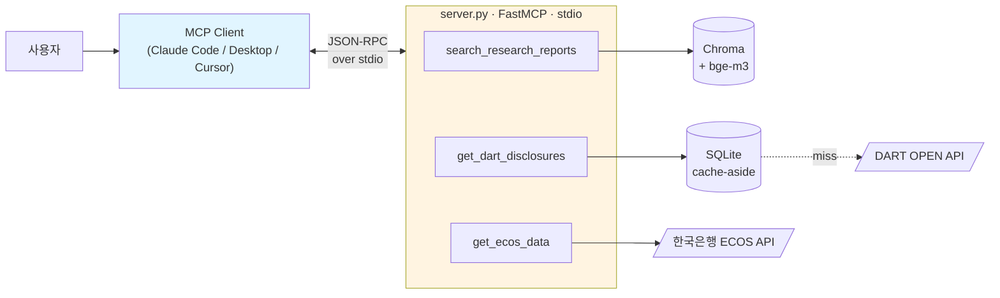
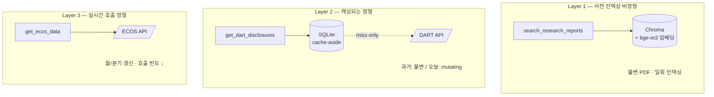
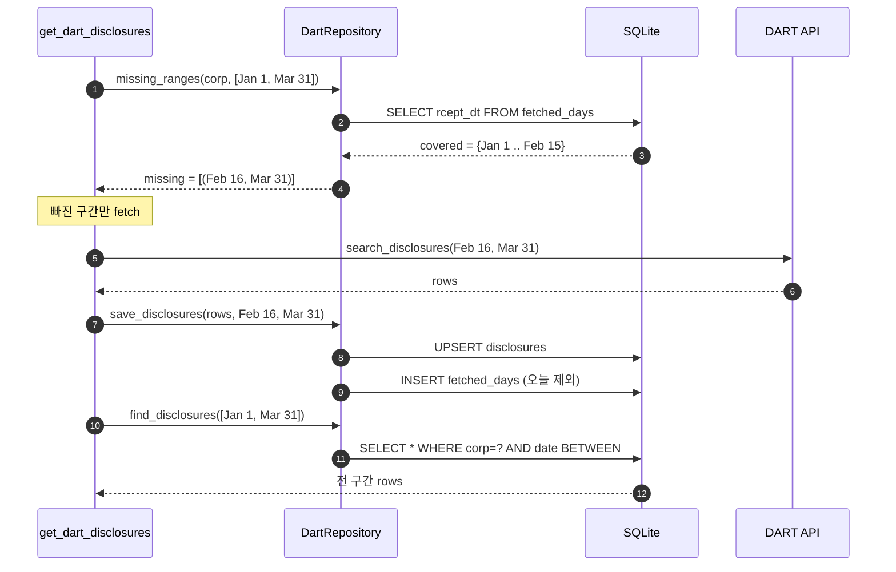
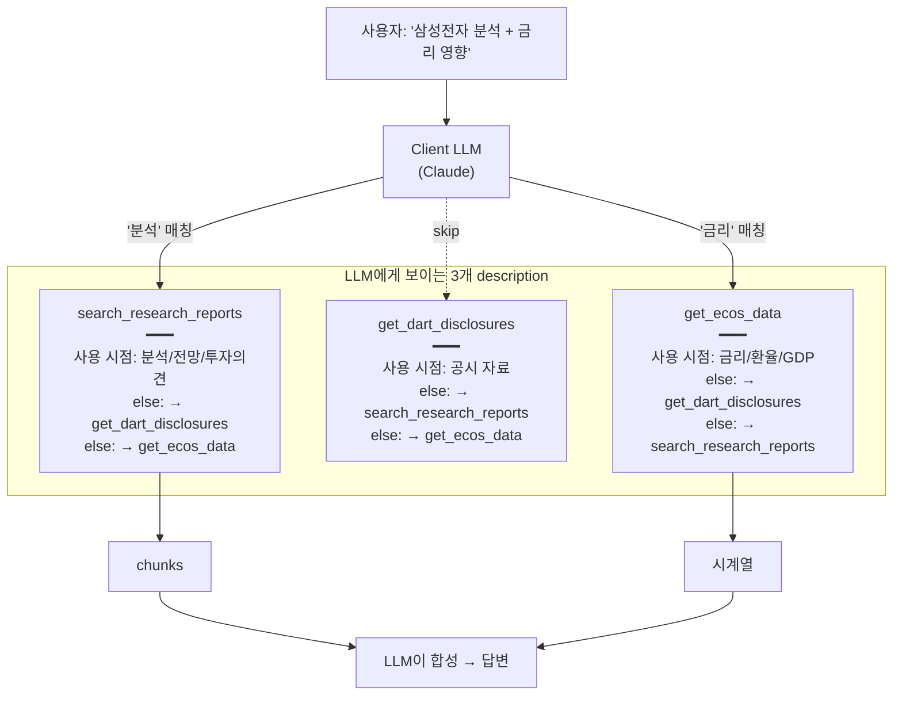
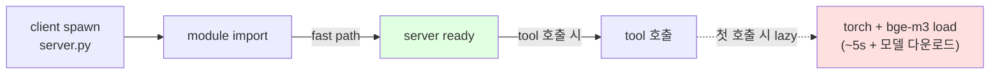

# ARCHITECTURE

`finance-mcp-assistant`는 **3개의 데이터 레이어**를 단일 MCP 서버로 묶고, 각 레이어를 별도 MCP tool로 노출합니다. 이 구조가 시스템의 중심 아이디어입니다.

설계 근거: [Decisions.md](Decisions.md) · 사용 시나리오: [README.md](README.md)

---

## 1. 시스템 개요

**핵심**:
- 클라이언트가 우리 서버 프로세스를 자식으로 spawn → stdin/stdout으로 JSON-RPC 송수신 (네트워크 포트 없음)
- 서버는 LLM을 직접 호출하지 않음 — LLM은 클라이언트 책임. 우리는 *도구만 제공*
- 도구 3개는 모두 독립. 조합은 클라이언트 LLM이 결정 (다이어그램 4 참조)

---

## 2. 3 데이터 레이어 — 변동성/접근 패턴별 차등 정책

| Layer | 변동성 | 호출 빈도 | 저장 전략 | 이유 |
|---|---|---|---|---|
| 1. 리서치 리포트 | 불변 | (인덱싱 1회) | 사전 임베딩 → 벡터 검색 | 의미 검색 = 벡터 외 대안 약함 |
| 2. DART 공시 | 과거 불변 / 오늘 변경 | 자주 | cache-aside (incremental) | 외부 API 비용/지연 최소화 |
| 3. ECOS 거시 | 월/분기 갱신 | 적음 | 직접 호출, 캐시 없음 | ROI 낮음 (호출량 적고 데이터량 작음) |

**모든 데이터를 동일하게 다루지 않는다**가 핵심 — Decisions.md §7 참조.

---

## 3. Cache-aside 내부: incremental day coverage

이게 단순 hit/miss와 다른 부분입니다. 한 번의 요청 안에서 캐시에 *부분적으로 있는 경우* 빠진 부분만 DART를 부릅니다.

**두 테이블 분리가 핵심**:
- `disclosures` — 실제 공시 행
- `fetched_days` — *그 날을 한 번이라도 호출했는가* 플래그 (코드와 날짜 페어)

**왜 두 테이블?** 0건짜리 날도 *"조회됨"* 으로 마킹해야 다음에 재호출 안 하니까. *"행 존재 = 조회됨"* 으로 추론 불가.

**오늘은 영구 마킹 제외**: 장중 추가 공시 가능성 → save 시 오늘 날짜는 fetched_days에 안 넣음 → 다음 호출 시 항상 fresh fetch.

---

## 4. Tool routing — 도구는 독립이지만 LLM이 묶음

**Tool description = LLM 라우팅의 프롬프트.** Decisions.md §9의 핵심:
- "사용 시점" + "사용하지 않을 때 → 형제 tool 명시" 형식
- 형제 tool 이름이 들어가는지 자동 검증 (테스트 `test_descriptions_cross_reference_each_other`)
- 면접 답변: *"tool description은 단순 문서가 아니라 LLM의 routing 프롬프트. cross-reference로 정확도를 높였고 테스트로 회귀 방지까지"*

---

## 5. Lazy import — stdio MCP의 운영적 특성

**stdio = 매 클라이언트 spawn마다 fresh 프로세스.** Eager import 시 서버 startup 25초 → UX 직격타.

대응: `rag/embedding.py`에서 `torch`, `HuggingFaceEmbedding`을 함수 본문 안에서 import. 결과:
- 모듈 import: 35s → **2.87s**
- DART/ECOS 도구만 쓰는 사용자는 ML 의존성 끝까지 안 끌어들임

상세: Decisions.md §13.

---

## 6. 의도적 제외

다이어그램에 안 나타나는 것들 — **있어 보이는데 일부러 안 만든 것**:

- **자체 LLM provider 추상화** — MCP가 이미 그 추상화. 위에 올리면 군더더기 (§3)
- **자체 임베딩 추상화 레이어** — LlamaIndex `BaseEmbedding`이 표준. 위에 올리면 같은 패턴 (§6)
- **HTTP transport** — 사이드 프로젝트엔 stdio 적합. FastMCP가 한 줄로 전환 가능 (§2)
- **OAuth/스코프** — HTTP 갈 때 같이 검토 (§14)

전체 목록: Decisions.md "안 한 것" 표.

---

## 부록: 코드 위치

| 다이어그램 요소 | 파일 |
|---|---|
| MCP 서버 + tool 등록 | `server.py` |
| 3 tool 함수 | `tools/disclosures.py`, `tools/research.py`, `tools/macro.py` |
| DART/ECOS 클라이언트 | `clients/dart.py`, `clients/ecos.py` |
| Cache-aside repository | `storage/repository.py` |
| SQLite 스키마 | `storage/db.py` |
| RAG 파이프라인 | `rag/{embedding,indexer,retriever}.py` |
| 환경 설정 | `config.py` (.env 로드 + 로거 silence + 키 마스킹) |
